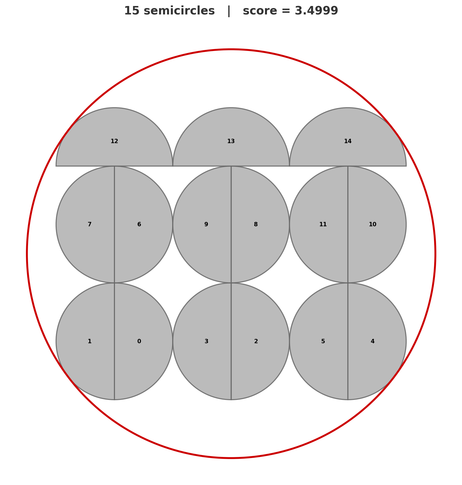

# Semicircle Packing Challenge

Pack **15 unit semicircles** (radius = 1) into the smallest possible enclosing circle.

Your **score** is the radius of the enclosing circle. Lower is better.

The baseline scores 3.50. The theoretical lower bound is ~2.74. How close can you get?



## Getting Started

```bash
uv sync
uv run python run.py
```

That's it. You'll see your score and whether the packing is valid (no overlaps).

## What to Edit

Open `solve.py`. Return a list of 15 `Semicircle(x, y, theta)` placements:

- **(x, y)** — center of the full disk
- **theta** — angle (radians) the curved part extends toward. The flat edge passes through (x, y) perpendicular to theta.

## Other Commands

```bash
uv run python run.py --save-plot packing.png   # save a visualization
uv run python run.py --visualize                # open plot in a window
uv run python run.py --export results.json      # export results as JSON
uv run pytest                                   # run tests
```
