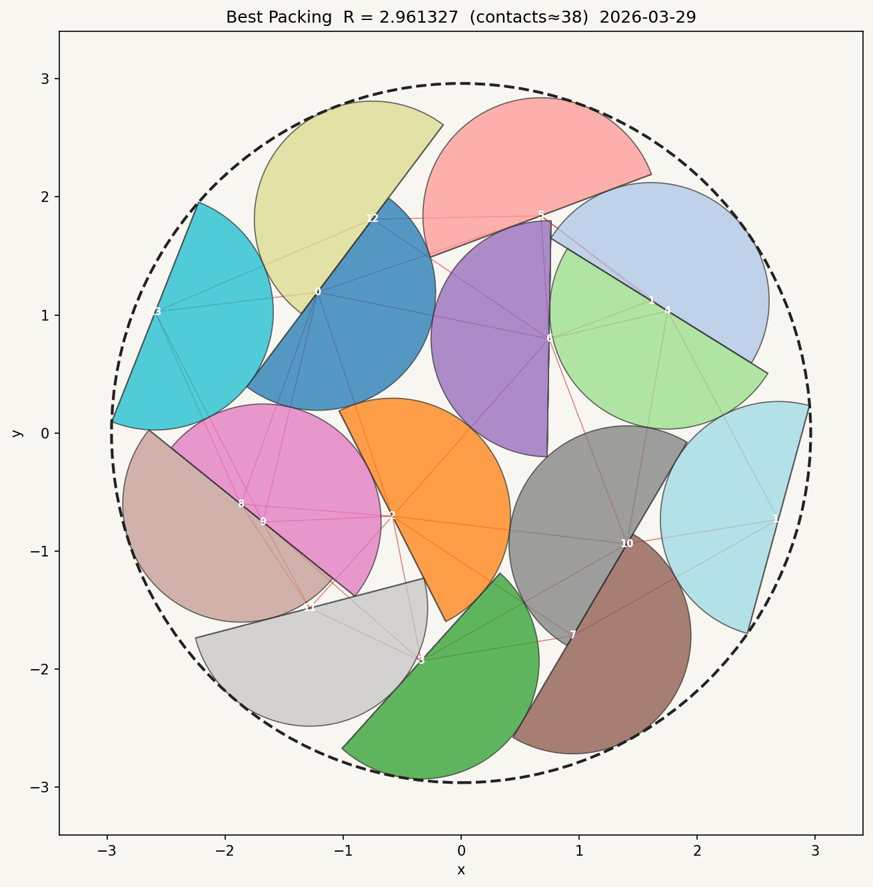

# Semicircle Packing Challenge

Pack **15 unit semicircles** (radius = 1) into the smallest possible enclosing circle.

**Best result: R = 2.948572** (enclosing circle radius), achieved over 27 days of computation (Mar 26 -- Apr 22, 2026) across multiple algorithmic phases and 662 git-tracked solution commits.



## Results

| Phase | Score (R) | Method | Key insight |
|-------|-----------|--------|-------------|
| Baseline | 3.500 | Grid layout | Starting point |
| Phase 1 | 2.970 | Numba SA + hill-climber | Fast approximate search finds ring topology |
| Phase 2 | 2.961 | Large Neighbourhood Search (LNS) | Destroy-reinsert breaks contact-graph barriers |
| Phase 2b | 2.960 | Exact-oracle polishing | Greedy hill-climbing with Shapely validation |
| Phase 3 | 2.949 | Fast approximate MCMC | Cheap inner loop + exact gate discovers new basin |
| Phase 4 | **2.948572** | Nano polisher | Sub-millionth incremental refinement |

The area lower bound is R = 2.739 (perfect density). Our result is 7.6% above this floor.

## Paper

A detailed writeup of methods, results, and analysis is in [`RESEARCH.tex`](RESEARCH.tex) ([PDF](RESEARCH.pdf)).

## Quick start

```bash
uv sync
uv run python run.py                        # score best_solution.json
uv run python run.py --visualize             # open plot in a window
uv run python run.py --save-plot packing.png # save a visualization
uv run pytest                                # run tests
```

## Solution format

`best_solution.json` is a JSON array of 15 semicircle placements:

```json
[
  { "x": -0.620142, "y": -0.083204, "theta": 4.389863 },
  ...
]
```

- **(x, y)** -- center of the full unit disk
- **theta** -- angle (radians) the curved part extends toward; the flat edge passes through (x, y) perpendicular to theta

Coordinates are rounded to 6 decimal places (matches the [Optimization Arena](https://optimization-arena.com/packing) server).

## Repo structure

### Core

| File | Description |
|------|-------------|
| `run.py` | Score and visualize any solution file |
| `best_solution.json` | Current best solution (R = 2.948572) |
| `solution.json` | Working solution file |
| `src/semicircle_packing/` | Core library: geometry, scoring, visualization, baselines |
| `tests/` | Unit tests for geometry and scoring |
| `pyproject.toml` | Project config and dependencies |

### Optimizers (chronological)

These scripts represent the full progression of approaches tried. Each is standalone and can be read independently.

| Script | Method | Result |
|--------|--------|--------|
| `optimize.py` -- `optimize7.py` | Early penalty-based SA iterations | R ~ 3.0 |
| `sa_numba.py`, `sa_v2.py`, `sa_v3.py` | Numba-JIT simulated annealing | R ~ 2.976 |
| `hillclimber2.py`, `hillclimber3.py` | Greedy Shapely hill-climber | R ~ 2.974 |
| `lns2.py`, `lns3.py`, `lns3_worker.py` | Large Neighbourhood Search + GJK polish | **R = 2.961** |
| `deep_polish.py`, `coordinated_polish.py` | Exact-oracle polishing | R ~ 2.960 |
| `fast_mcmc.py` | Fast approximate MCMC with exact gate | **R = 2.949** |
| `mcmc_exact.py` | Exact-oracle MCMC nano polisher | **R = 2.948572** |

### Methods that didn't work

| Script | Method | Why it failed |
|--------|--------|---------------|
| `phi.py` | Phi-function energy (Chernov 2012) | False positives for non-antiparallel flat faces |
| `mbh.py` | Monotonic basin hopping | L-BFGS-B converges to phi-function artifacts |
| `pbh.py` | Population basin hopping | Same root cause as MBH |
| `fss.py` | Formulation space search (polar coords) | Doesn't fix the energy approximation |
| `orient_flip.py` | Orientation flip search | Basin is unreachable via theta+pi flips |
| `random_multistart.py` | Random multistart SA | Rarely finds ring topologies |
| `optimize_gpu.py` | GPU-accelerated search | Overhead > benefit at this scale |
| `cmaes_tight.py` | CMA-ES | Poor performance on constrained non-convex landscape |

### Supporting modules

| File | Description |
|------|-------------|
| `gjk_numba.py` | GJK distance computation (Numba JIT) |
| `exact_dist.py` | Exact signed distance utilities |
| `seeds.py` | Seed solution generators |
| `swarm.py` | Multi-worker orchestrator |
| `topo_search.py`, `topology_run.py` | Topology enumeration experiments |

### Data

| Path | Description |
|------|-------------|
| `solutions/` | Archive of 150+ scored solution snapshots (R = 2.970 down to 2.948572) |
| `solutions/best_approx/` | Near-miss solutions from approximate MCMC (some invalid) |
| `figures/` | Rendered figures for the paper (milestone progression) |
| `baseline.png` | Original 3x5 grid baseline |
| `best_solution.png` | Visualization of the best solution |

## Key findings

1. **Ring topologies dominate.** The best solutions use 3-11-1 (3 inner, 11 mid-ring, 1 boundary) or 4-11 ring arrangements. All other topologies tested score above R = 3.4.

2. **Exact oracles beat approximate gradients for local refinement.** When feasibility evaluation costs ~0.5ms (Shapely), a greedy hill-climber outperforms L-BFGS-B with approximate phi-function energy.

3. **Approximate inner loops enable basin exploration.** The two largest improvements (LNS: delta R = 0.013, fast MCMC: delta R = 0.011) both used methods that could modify the contact graph at speeds impossible for exact-oracle methods.

4. **The landscape is multi-modal with high inter-basin barriers.** The 3-11-1 and 4-11 topologies are distinct basins separated by barriers that no continuous exact-oracle perturbation could cross.

## License

MIT

## Acknowledgements

- Problem posed by [benedictbrady](https://github.com/benedictbrady) via the [Optimization Arena](https://optimization-arena.com/packing)
- Fast MCMC approach inspired by [compusophy](https://github.com/compusophy)'s browser-based parallel tempering optimizer
